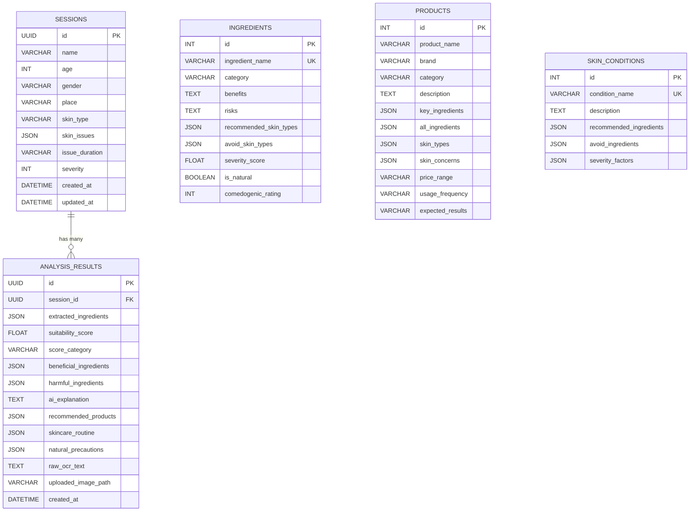

# DermaGenie — ER Diagram

## Database Schema

## Table Descriptions

### sessions
Stores the user's profile and skin assessment data. Each user interaction creates a new session (no authentication). The `skin_type`, `skin_issues`, `issue_duration`, and `severity` fields are populated after the skin analysis step.

### ingredients
Reference table of 80+ skincare ingredients with metadata: benefits, risks, skin type compatibility, comedogenic rating, and severity score. Used by the scoring engine to evaluate extracted ingredients.

### products
Reference table of 40+ real skincare products with their key ingredients, target skin types, and skin concerns. Used by the recommendation engine and seeded by `seed_data.py`.

### skin_conditions
Reference table of 13 common skin conditions with recommended and avoid ingredient lists. Used by the scoring engine to apply condition-specific bonuses and penalties.

### analysis_results
Stores the complete output of each analysis: suitability score, beneficial/harmful ingredients, AI explanation, product recommendations, skincare routine, and natural precautions. Linked to a session via `session_id` FK.

## Relationships

- **sessions → analysis_results**: One-to-many. A session can have multiple analyses (one per product upload).
- **ingredients**: Standalone reference table. Queried by the scoring engine via `ILIKE` matching against extracted ingredient names.
- **products**: Standalone reference table. Used by the Gemini AI and recommendation engine.
- **skin_conditions**: Standalone reference table. Cross-referenced during scoring to apply condition-specific adjustments.

## Indexes

| Table | Index | Columns |
|---|---|---|
| sessions | ix_sessions_created_at | created_at |
| ingredients | ix_ingredients_name | ingredient_name |
| ingredients | ix_ingredients_category | category |
| products | ix_products_brand | brand |
| products | ix_products_category | category |
| skin_conditions | ix_skin_conditions_name | condition_name |
| analysis_results | ix_analysis_results_session_id | session_id |
